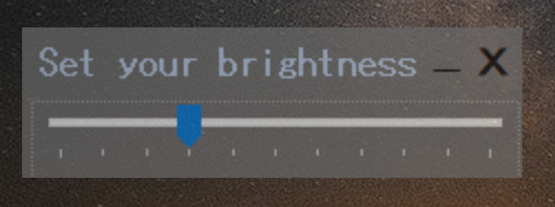
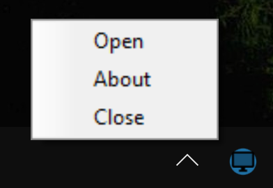
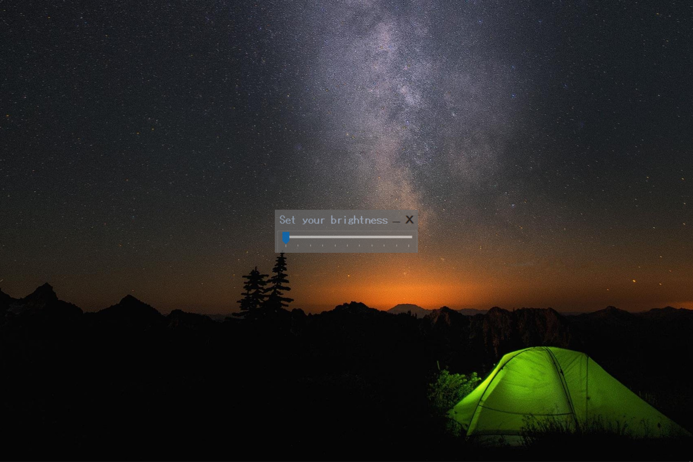
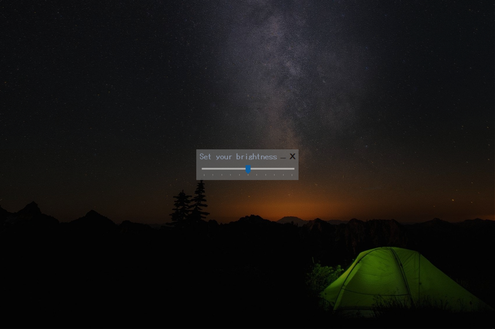
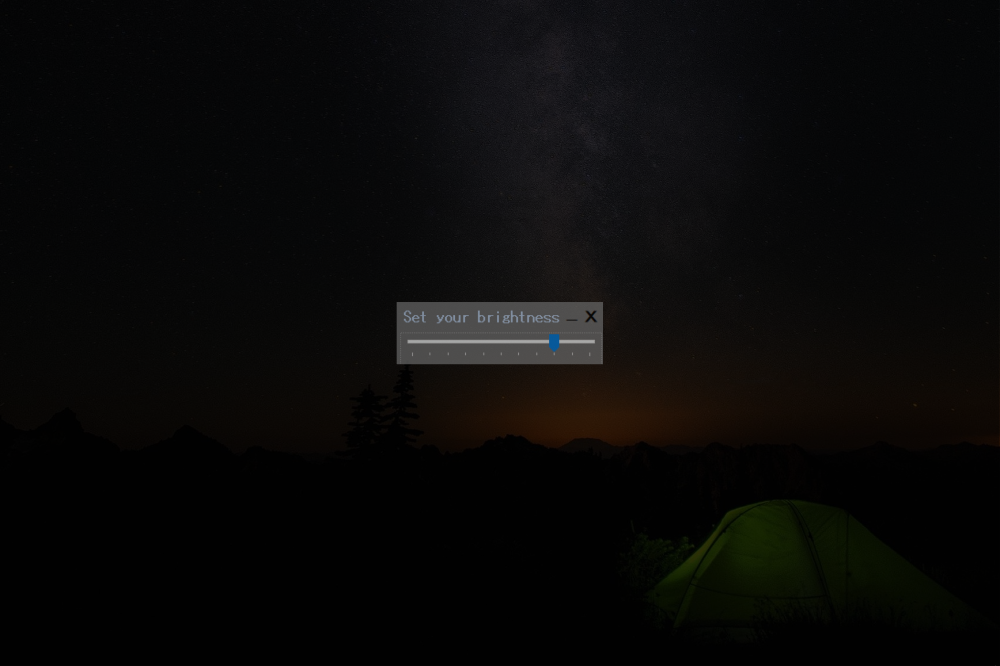

# Screen Filter for Window

A screen filter/dimmer I was using all these years broke  
Wrote a simple screen filter overlay to filter out the brightness

Tested on window 10. 

#### Main Interface  
1. Scrollbar to adjust overlay opacity  
2. Close and Minimize button keep to system tray  
        

#### System Tray  
1. Right click to access  
   1. Open - open main interface  
   2. About - show information  
   3. Close - close application  
2. Left click to open main interface  
        

#### What it looks like at work...
at 0%
 
at 50%
 
at 80%

